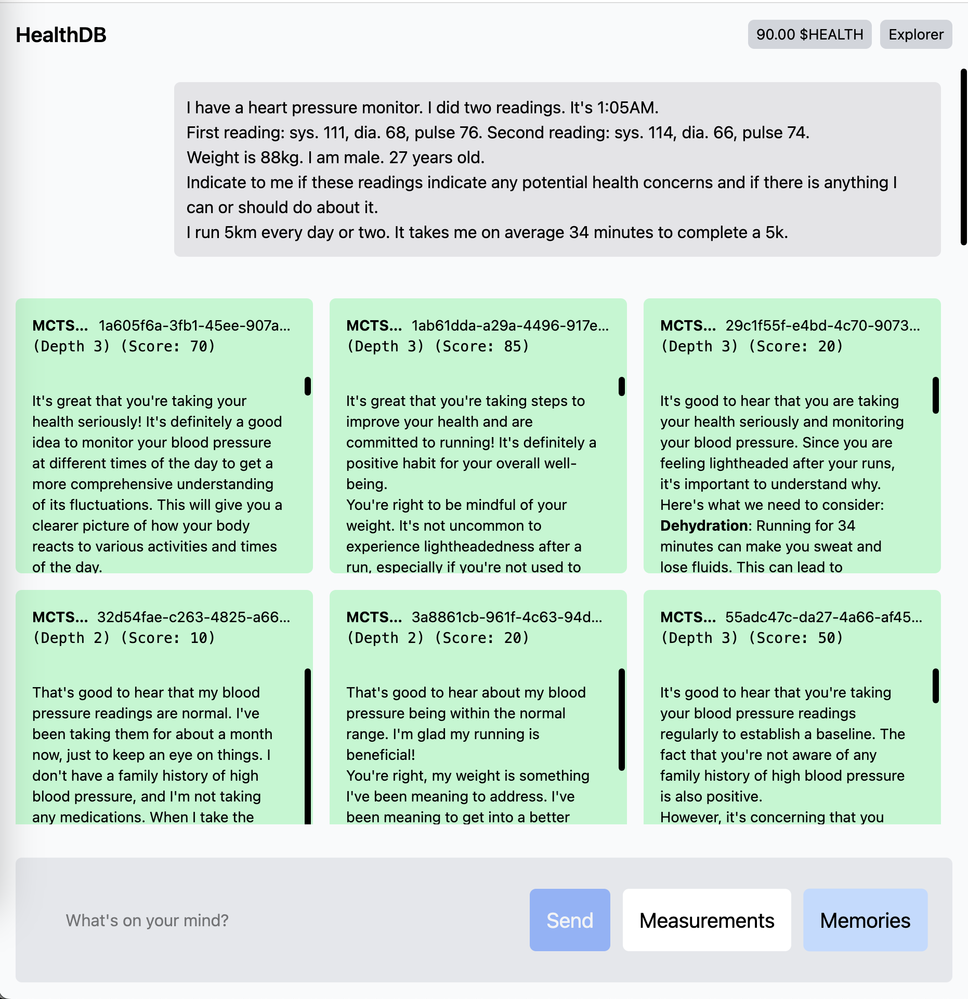

# healthdb


HealthDB is an AI agent that organizes, collates, and enriches your personal health information. It was developed with the motivation of allowing users to have a structured, queryable database of their symptoms, health records, and medical history in order to combat [diagnostic errors that costs hundreds of thousands of lives each year](<[text](https://www.businessinsider.com/doctors-misdiagnose-lower-risk-deaths-2023-7)>).




https://github.com/user-attachments/assets/e4962b90-78a5-4f7f-a7bb-711475ac83c2


Data is collected from a variety of sources, including your:

- medical records,
- lab results,
- wearable devices,
- medical devices (i.e. blood pressure monitor),
- clinical notes,

... and your conversations with HealthDB itself.

To ensure that responses are informative and context-aware, every reply by HealthDB to your queries is generated via a probabilistically-weighted Monte Carlo Tree Search over hundreds of LLM invocations that are scored based on the quality of each individual response.

The entire system runs locally on your device to ensure compliance with GDPR and HIPAA, safeguarding your sensitive health information.

In order to pay for the compute used to run the AI agent, a micropayment protocol was developed and deployed on Aptos Testnet.

The micropayments protocol is a Move smart contract that allows for deferring the finality of payments between the user and the compute used to run the AI agent in order to optimize transaction fees.

A `HEALTH` token was created to represent the micropayments protocol, with intentions to have the token be used to foster a computing marketplace and developer community that powers a health-focused AI agent ecosystem.

To install dependencies:

```bash
bun install
```

To run:

```bash
bun dev
```

This project was created using `bun init` in bun v1.2.3. [Bun](https://bun.sh) is a fast all-in-one JavaScript runtime.
